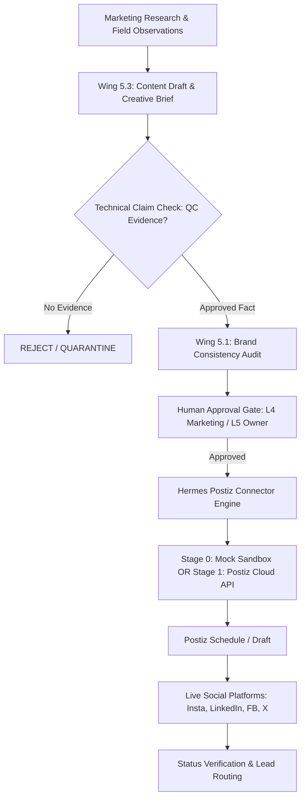

# Hermes-to-Postiz Native Integration Design (Zero Docker)

**Document ID:** DSG-HERMES-POSTIZ-01  
**Version:** 1.0.0  
**Architectural Standard:** Internal Hermes Orchestration + Lightweight REST Client  

---

## 1. Architectural Philosophy: The "Dumb Pipe" Principle
- **Postiz is ONLY a publishing and scheduling engine.**
- **Hermes owns 100% of the intelligence:**
  - Market research and dealer feedback synthesis
  - B2B content planning and copy generation
  - Mandatory Paint Technical Claim & BIS Evidence verification
  - Regional language review (Hindi, Hinglish, Rajasthani context)
  - Level 4 / Level 5 human approval workflows
  - Post-publishing performance analysis and sales lead routing



---

## 2. Directory Layout & Module Structure
The entire Postiz integration resides inside `hermes-agent` without modifying existing core wings:

```
d:\Sharma Industries Erp Software\hermes-agent├── postiz-integration│   ├── connector│   │   ├── __init__.py
│   │   ├── client.py            # Native Python HTTP client for Postiz API
│   │   ├── mock_server.py       # Offline Stage 0 Sandbox Mock Server
│   │   ├── schemas.py           # Pydantic / TypedDict request/response contracts
│   │   └── security.py          # Account whitelisting & wrong-account guardrails
│   ├── tests│   │   ├── __init__.py
│   │   ├── test_postiz_client.py
│   │   └── test_safety_gates.py
│   └── docs\ (Audit & Planning Deliverables)
```

---

## 3. Post Creation Lifecycle & States
Every post progresses through a strictly monitored state machine:

1. `IDEA_LOGGED`: Raw content concept tagged with target audience (Dealer / Painter / Builder).
2. `EVIDENCE_VERIFIED`: All product performance claims cross-checked against BIS IS 15489 lab reports.
3. `DRAFT_PREPARED`: Platform-tailored captions and image design briefs written.
4. `APPROVAL_PENDING`: Staged in Hermes review queue with full attribution.
5. `APPROVED`: Level 4 Marketing Lead sign-off (or Level 5 Owner sign-off for offers/schemes).
6. `POSTIZ_STAGED`: Sent to Postiz as `type: "draft"` or `type: "schedule"`.
7. `PUBLISHED`: Verified published via Postiz status check.
8. `FAILED_ALERTED`: Publishing failure caught; retry logged with zero-duplicate policy.
